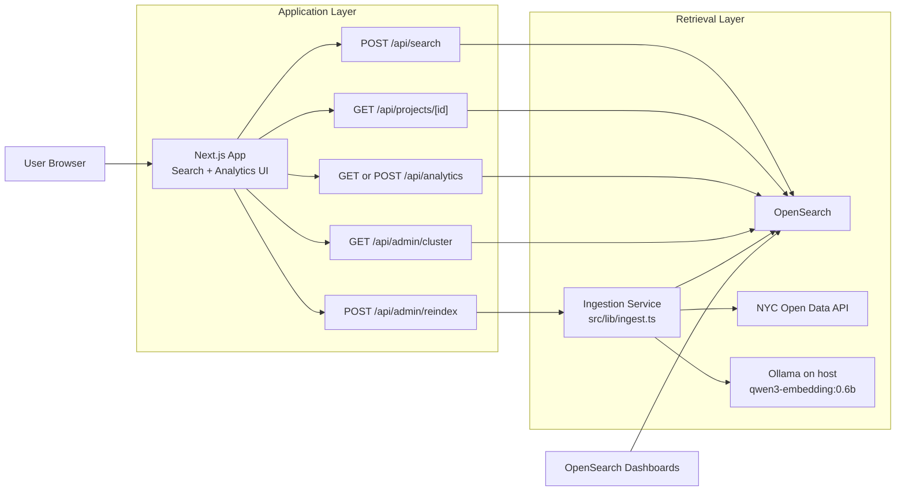
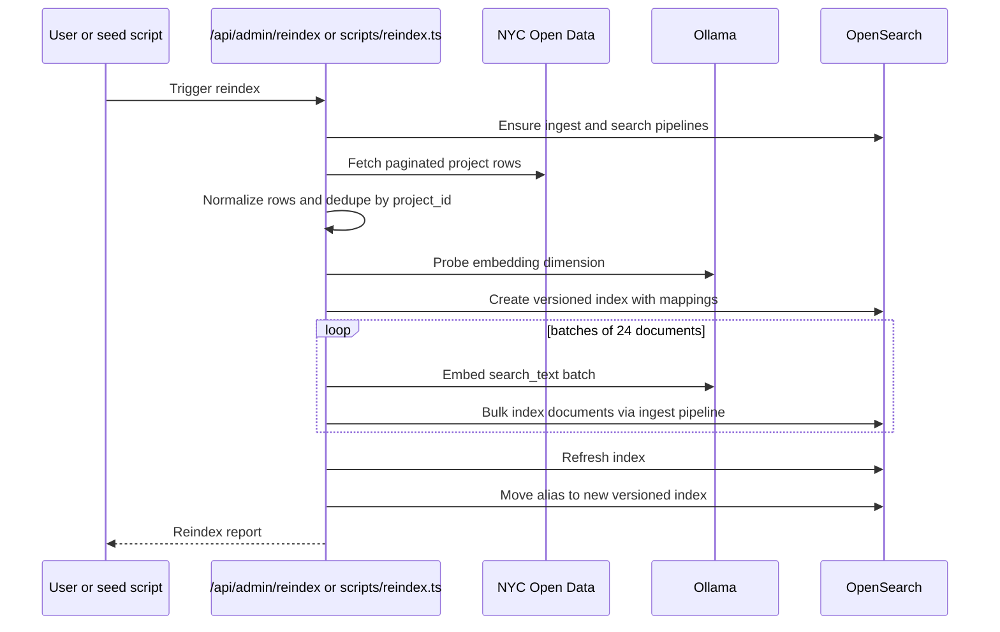

# OpenSearch Research Sandbox: Deep Dive

## Purpose

This document explains the full implementation of the local OpenSearch research sandbox in this repository:

- what is implemented today
- how the ingestion and query paths work
- how the UI is structured
- which OpenSearch capabilities are already exercised
- what production-grade extensions are still missing
- how OpenSearch compares with other self-hosted search, analytics, and AI retrieval stacks

This is both an architecture guide and a decision memo.

Important framing:

- The current repo is a research sandbox, not a production deployment.
- The comparison and recommendation sections below are a fit benchmark for this repo's requirements, not a synthetic latency shootout across vendors.
- The recommendation that OpenSearch is the best fit is an inference from the requirements of this project plus the current official capabilities of the compared systems. It is not a universal claim that OpenSearch is always the best database.

## Executive Summary

If the goal is a self-hosted platform that combines:

- strong full-text retrieval
- faceting and aggregations
- vector search
- hybrid lexical plus semantic search
- analyst-friendly dashboards
- reasonable AI extension points
- permissive open-source licensing

then OpenSearch is the strongest single-stack fit for this repo.

Why:

- It is already a mature search and analytics engine, not only a vector store.
- It gives us Lucene-style full-text relevance controls and OpenSearch Dashboards in the same platform.
- It supports vector search, filtered k-NN, hybrid search, search pipelines, alerting, anomaly detection, SQL/PPL, and index lifecycle tooling.
- It remains Apache 2.0 licensed, which matters for self-hosted internal platforms and embedded usage.

Why not always:

- If the primary problem is pure OLAP analytics at extreme compression and SQL-first exploration, ClickHouse can be stronger.
- If the primary problem is pure vector retrieval and AI-native developer ergonomics, Qdrant or Weaviate may be simpler.
- If the primary problem is "the easiest search-as-you-type product catalog", Typesense or Meilisearch can be faster to ship.
- If the team wants to consolidate inside an existing PostgreSQL estate and accept weaker search semantics, PostgreSQL plus pgvector can be good enough.

## Repository Scope

### What this repo currently implements

- A local Docker Compose stack with:
  - OpenSearch `3.3.0`
  - OpenSearch Dashboards `3.3.0`
  - a Next.js `16` application
- Host-based Ollama embeddings using `qwen3-embedding:0.6b`
- A seed and reindex flow that fetches the NYC Parks Capital Project Tracker public dataset
- Data normalization into a canonical `CapitalProjectDocument`
- A versioned index plus alias pattern
- An ingest pipeline and a hybrid search pipeline
- A search workbench with:
  - lexical search
  - vector search
  - hybrid search
  - advanced filters
  - search-as-you-type
  - debug tabs for raw request and response inspection
- An analytics page with:
  - KPI cards
  - OpenSearch aggregations
  - area charts using `shadcn/ui` chart primitives and `recharts`
  - a rich multi-row filter builder inspired by tools like Langfuse

### What this repo intentionally does not implement yet

- RAG or answer generation
- OpenSearch ML Commons remote model connectors
- multi-node clustering
- snapshots, index state management policies, tiering, and disaster recovery
- multi-tenant auth in the Next.js app
- synonym sets, spelling correction, reranking, or relevance evaluation datasets
- streaming ingest, CDC, or event-driven updates

## System Architecture

### High-level architecture

### Reindex and alias-swap flow

## Implementation Map

### Infrastructure and runtime files

| Path | Responsibility |
| --- | --- |
| `docker-compose.yml` | Local stack orchestration for OpenSearch, Dashboards, and the Next.js app |
| `Dockerfile` | App container image |
| `.env.example` | Environment variable template |
| `package.json` | Scripts for dev, build, test, seed, and Docker workflows |

### Data and backend files

| Path | Responsibility |
| --- | --- |
| `src/lib/nyc-parks.ts` | Dataset fetcher and normalization from raw rows to canonical documents |
| `src/lib/ingest.ts` | Reindex flow, batching, embedding, bulk indexing, and alias switching |
| `src/lib/ollama.ts` | Ollama status checks, embedding calls, and dimension probing |
| `src/lib/opensearch/client.ts` | OpenSearch client setup and error serialization |
| `src/lib/opensearch/schema.ts` | Index mappings, ingest pipeline, search pipeline, alias helpers |
| `src/lib/opensearch/search.ts` | Search request builder and execution for lexical, vector, and hybrid modes |
| `src/lib/opensearch/analytics.ts` | Analytics aggregation query builder and response parsing |
| `src/lib/types.ts` | Shared request and response contracts |
| `src/lib/analytics-filters.ts` | Analytics filter schema, field definitions, and operator metadata |

### API routes

| Route | Responsibility |
| --- | --- |
| `POST /api/search` | Validates and executes search requests |
| `GET /api/projects/[id]` | Returns a single project detail document |
| `GET /api/admin/cluster` | Returns cluster and runtime health |
| `POST /api/admin/reindex` | Triggers the reindex workflow |
| `GET /api/analytics` | Returns the default analytics snapshot |
| `POST /api/analytics` | Returns a filtered analytics snapshot |

### UI files

| Path | Responsibility |
| --- | --- |
| `src/app/page.tsx` | Search page entry |
| `src/app/analytics/page.tsx` | Analytics page entry |
| `src/components/app/search-workbench.tsx` | Search UI, filters, results, detail drawer, debug tabs |
| `src/components/app/analytics-dashboard.tsx` | Analytics UI, charts, cards, trace tabs |
| `src/components/app/analytics-filter-builder.tsx` | Rich analytics filter workbench |
| `src/components/ui/*` | `shadcn/ui` building blocks and chart wrapper |

## Data Source and Normalization

### Why this dataset

The seed dataset is the NYC Parks Capital Project Tracker. It is a strong sandbox dataset because:

- it is public and stable enough for repeatable local testing
- it contains real capital project metadata
- it contains phase, timeline, budget, location, and funding signals
- it has enough structure to exercise filters, facets, date histograms, and map-ready fields

### Fetch behavior

The fetcher in `src/lib/nyc-parks.ts`:

- pages through the Socrata endpoint using `$limit` and `$offset`
- orders by `trackerid ASC`
- applies a `30s` timeout per request
- supports an optional `limit` for partial ingest

### Normalization behavior

The raw source is transformed into a canonical `CapitalProjectDocument`.

Key transformations:

- `currentphase` is normalized into lowercase `phase`
- `status` currently mirrors `phase`
- borough and funding strings are tokenized and mapped against known dictionaries
- budget strings are normalized into:
  - `budget_band`
  - `budget_min`
  - `budget_max`
  - `budget_sort`
- milestone fields are converted to `YYYY-MM-DD`
- `overall_percent_complete` uses the max of design, procurement, and construction completeness
- `forecast_completion` is inferred from the next meaningful milestone
- `location` becomes a `geo_point` when latitude and longitude are present
- `search_text` is assembled from title, description, location, phases, tags, boroughs, funding, and other useful retrieval text

### Deduplication

The source can contain multiple rows for the same project. The ingestion pipeline deduplicates by `project_id` and keeps the last occurrence before embedding. That avoids wasted embedding work and keeps bulk indexing behavior aligned with final stored documents.

## OpenSearch Design

### Cluster shape in this repo

Current local shape:

- single node
- `1` shard
- `0` replicas
- security plugin enabled
- HTTPS between the app and OpenSearch
- self-signed local certificates with certificate verification disabled in app env for local development

This is correct for a laptop sandbox and incorrect for production.

### Index versioning and aliasing

The repo uses a versioned index plus alias pattern:

- physical index example: `capital-projects-v20260315102030`
- read alias: `capital-projects-current`

Benefits:

- reindexing is repeatable
- mapping changes do not mutate an existing index in place
- rollback is conceptually simple
- the app always reads through a stable alias

### Mapping strategy

The mapping in `src/lib/opensearch/schema.ts` is deliberate:

- `keyword` fields for exact filters and facets:
  - `project_id`
  - `agency`
  - `phase`
  - `status`
  - `boroughs`
  - `funding_sources`
  - `budget_band`
  - `tags`
- `text` fields for retrieval:
  - `title`
  - `description`
  - `location_name`
  - `search_text`
- `search_as_you_type` subfields for autocomplete-like prefix matching on:
  - `title`
  - `location_name`
  - `search_text`
- numeric fields for sort and stats:
  - `budget_min`
  - `budget_max`
  - `budget_sort`
  - percent-complete fields
- date fields for milestone filtering and date histograms
- `geo_point` for location-aware search and future mapping features
- `knn_vector` for `project_embedding`
- `raw_source` stored as a disabled object to preserve provenance without exploding the index

### Vector indexing choices

The vector field uses:

- `knn_vector`
- HNSW
- Lucene engine
- cosine similarity
- `ef_construction: 128`
- `m: 24`

That is a practical default for a local retrieval sandbox:

- fast enough to experiment
- close enough to realistic production patterns to learn tradeoffs
- small enough to keep local indexing manageable

### Ingest pipeline

The ingest pipeline currently does three things:

- lowercases `agency`
- lowercases `phase`
- lowercases `status`
- stamps `ingested_at`

This is intentionally light. In production you would likely add:

- stronger text cleanup
- categorical normalization
- source validation
- dead-letter handling
- source lineage fields
- optional enrichment

### Search pipeline

Hybrid search uses a search pipeline with the OpenSearch `normalization-processor`.

Current behavior:

- min-max normalization
- arithmetic mean combination
- weights `[0.45, 0.55]`

Interpretation:

- lexical scores get a meaningful say
- vector scores get slightly more weight

This is a good research default, but not a universal setting. In production this weight should be tuned against judged relevance sets.

## Search Architecture

### Search modes

The app supports three modes:

1. `lexical`
2. `vector`
3. `hybrid`

All three share one request contract from `src/lib/types.ts`.

### Lexical search

Lexical search is BM25-oriented and uses:

- a fuzzy `multi_match` over title, description, location, search text, boroughs, funding, and budget band
- `bool_prefix` search across `search_as_you_type` subfields
- `match_phrase_prefix` boosts on `title`
- `match_phrase_prefix` boosts on `location_name`

This gives the app:

- exact and phrase-friendly retrieval
- typo tolerance
- prefix matching for search-as-you-type
- useful early results for short prefixes like `playg`

### Vector search

Vector mode:

- embeds the query through Ollama
- searches `project_embedding`
- uses filtered k-NN when structured filters are active

Current semantic behavior is intentionally simple:

- one embedding model
- one dense vector per document
- one dense vector per query

That is enough to understand basic semantic retrieval before introducing reranking or multi-vector designs.

### Hybrid search

Hybrid mode:

- runs lexical search and vector search together
- uses OpenSearch's `hybrid` query
- applies the configured search pipeline for score normalization and combination

Why hybrid matters:

- lexical search is better for exact titles, IDs, and rare tokens
- vector search is better for paraphrase and semantic intent
- hybrid usually wins for real user search because it captures both

### Filters and facets

The search page supports:

- phase filters
- borough filters
- funding source filters
- budget range filters
- completion date range filters
- updated-since filters
- `has_coordinates`
- optional geo distance filtering

Facet aggregations currently include:

- phases
- boroughs
- funding sources
- budget bands

### Search-as-you-type

The workbench now supports a live search mode:

- request debouncing
- stale-request cancellation with `AbortController`
- request de-duplication
- prefix-aware lexical search
- manual mode fallback when the user wants deliberate execution

Important operational note:

- `search_as_you_type` requires the mapping to exist in the index
- after adding those mapping fields, a reindex is required for the feature to work at full strength

### Debugging behavior

The search UI exposes raw request and response data because this repo is explicitly for research.

This is valuable because it lets you inspect:

- generated OpenSearch DSL
- aggregation structures
- search mode fallback behavior
- result scores
- profile and explain output where supported

Known limitation:

- OpenSearch `3.3.0` can throw an internal Neural Search null-pointer when hybrid search is combined with verbose `profile` and `explain`
- the repo works around this by omitting those flags for hybrid debug mode while still returning the raw request and response

## Analytics Architecture

### Analytics philosophy

The analytics page is not a separate OLAP system. It is intentionally built on OpenSearch aggregations over the same search corpus.

That is important because one of the key reasons to pick OpenSearch is reducing stack sprawl:

- one search corpus
- one cluster
- one retrieval platform
- one analyst-facing UI

### Aggregations currently used

The analytics query in `src/lib/opensearch/analytics.ts` uses:

- `stats` on `budget_sort`
- `percentiles` on `budget_sort`
- `avg` on `overall_percent_complete`
- `filters` aggregations for phase status rollups
- `terms` aggregations for:
  - phase
  - borough
  - funding source
- `date_histogram` on `forecast_completion`
- nested metrics within the date histogram:
  - `sum` budget
  - `avg` completion
  - `filters` for phase mix

### Analytics filters

The analytics page supports a richer filter grammar than the search page.

Supported filter families:

- options
- string
- number
- date
- boolean

Supported operator patterns include:

- `any_of`, `none_of`, `all_of`
- `equals`, `contains`, `not_contains`, `starts_with`, `ends_with`
- `eq`, `gt`, `gte`, `lt`, `lte`
- `on`, `before`, `after`, `on_or_before`, `on_or_after`, `is_null`, `is_not_null`
- `is`

Current semantics:

- all analytics filters are applied at the query root
- filters are ANDed together

This is the right default for analytics slicing.

### Analytics UI composition

The analytics UI contains:

- portfolio KPI cards
- delivery mix area chart
- capital exposure area chart
- bucketed breakdown cards
- rich filter builder
- raw aggregation request and response tabs
- analyst notes derived from the aggregation result

This is intentionally not just a chart page. It is also a query inspection page.

## Frontend and UX Design

### Search page

The search workbench is built in `src/components/app/search-workbench.tsx`.

Primary regions:

- top controls and cluster health
- query bar and mode switcher
- advanced filters
- result list
- detail drawer
- debug tabs

Research-oriented behavior:

- request DSL is visible
- cluster and pipeline readiness are visible
- reindex is accessible from the UI

### Analytics page

The analytics page is built in `src/components/app/analytics-dashboard.tsx`.

Design goals:

- show that OpenSearch can support analyst workflows, not only search boxes
- make aggregation logic visible
- demonstrate charting and filter composition
- provide a familiar, modern UI using `shadcn/ui`

### Component choices

The project uses:

- `shadcn/ui` primitives for cards, tabs, tables, sheets, alerts, badges, switches, selects, and inputs
- a `shadcn` chart wrapper around `recharts`
- a consistent design system for both search and analytics views

## Operational Considerations

### What is good about the current local design

- easy to boot with Docker Compose
- realistic enough to teach OpenSearch workflows
- secure by default compared with many local demos
- transparent enough to inspect raw search and aggregation behavior
- small enough to debug quickly

### What is intentionally weak because this is a sandbox

- single node
- no replicas
- no snapshots
- no index state management policies
- no object-store tiering
- no application-level authentication
- no ingest queue or retry worker
- no async reindex job management
- no benchmark automation

### Specific implementation caveats

1. Ollama runs on the host, not in Compose.

Reason:

- on macOS, that is the most practical path for local embeddings
- it aligns with Ollama's platform guidance for GPU usage and local developer experience

2. Mapping changes require reindexing.

Examples:

- adding `search_as_you_type`
- changing vector dimensions
- changing analyzers

3. The public dataset is useful but imperfect.

Examples:

- multiple rows can map to one project ID
- budget is often a band, not a precise numeric
- phase is not a complete project management model
- coordinate coverage is incomplete

4. Hybrid debug in OpenSearch `3.3.0` has a known practical limit in this repo.

The workaround is already in place.

### Productionization checklist

If this research sandbox graduates toward production, the next items should be:

- multi-node cluster topology
- dedicated ingest and data nodes if scale warrants it
- snapshot repository and restore drills
- ISM policies for rollover and retention
- proper certificates and TLS verification
- OIDC or SAML authentication and RBAC
- index templates and possibly data streams where appropriate
- synonym pipelines and typo strategy
- relevance judgments and benchmark harness
- reranking and evaluation loops
- ML Commons connectors if native model orchestration becomes attractive
- observability, alerts, and runbooks

## Why OpenSearch Fits This Use Case Best

### The repo's actual requirement is not just "search"

This repo needs one stack that can do all of the following:

- full-text search
- semantic retrieval
- hybrid retrieval
- faceting
- aggregations
- analyst dashboards
- geo support
- self-hosting
- extensibility toward AI workflows

That immediately narrows the field.

### OpenSearch is strongest when one team wants one platform

OpenSearch wins this repo's decision because it reduces the need for a multi-engine architecture like:

- PostgreSQL for system-of-record data
- a vector database for semantic retrieval
- a BI engine for analytics
- a custom dashboard layer for analysts

You can absolutely build that multi-engine stack. Many teams do. But it increases:

- operational overhead
- synchronization complexity
- indexing complexity
- schema drift risk
- security boundary count
- debugging cost

For a self-hosted internal platform, that matters.

### OpenSearch's strongest advantages for this repo

1. It is already a search engine and analytics engine.

You do not have to "teach" it faceting, aggregations, phrase search, analyzers, highlighting, geo filters, or dashboards.

2. It supports hybrid search natively.

This is the single most important capability for this repo because the workbench is explicitly about combining lexical and semantic retrieval.

3. It includes an analyst UI story.

OpenSearch Dashboards is not just a nice-to-have. It is one of the reasons OpenSearch is stronger than pure vector databases or simpler search engines for internal platforms.

4. It remains permissively licensed.

For self-hosting, internal distribution, embedding, and long-term control, Apache 2.0 is materially simpler than more restrictive alternatives.

5. It has adjacent capabilities that matter later.

Examples:

- alerting
- anomaly detection
- SQL and PPL
- index state management
- observability patterns
- ML Commons and remote model connectors

## Alternatives to OpenSearch

### Shortlist considered

The most relevant alternatives for this repo are:

- Elasticsearch
- Apache Solr
- ClickHouse
- PostgreSQL plus pgvector
- Typesense
- Meilisearch
- Qdrant
- Weaviate

### How to interpret the comparison

The table below is a weighted fit benchmark for this repo's requirements.

It is not:

- a universal ranking
- a raw throughput benchmark
- a vendor-neutral TPC-style study

It is:

- a transparent decision matrix
- weighted toward self-hosted search plus analytics plus AI retrieval

Scoring scale:

- `5` = excellent fit
- `4` = strong fit
- `3` = workable fit with notable compromises
- `2` = weak fit
- `1` = poor fit

### Criteria and weights

| Criterion | Weight |
| --- | ---: |
| Full-text relevance and query control | 20 |
| Facets, aggregations, and analyst workflow | 20 |
| Vector and hybrid retrieval | 15 |
| Self-hosting and licensing flexibility | 15 |
| Operational maturity | 15 |
| AI and ML extensibility | 10 |
| Simplicity and developer velocity | 5 |

### Weighted fit benchmark

| Engine | Search | Analytics | Vector/Hybrid | Self-hosting | Ops | AI Extensibility | DX | Weighted Fit |
| --- | ---: | ---: | ---: | ---: | ---: | ---: | ---: | ---: |
| OpenSearch | 5 | 5 | 4 | 5 | 4 | 4 | 3 | 4.55 |
| Elasticsearch | 5 | 5 | 5 | 3 | 5 | 5 | 4 | 4.45 |
| ClickHouse | 3 | 5 | 3 | 4 | 4 | 3 | 4 | 3.75 |
| Apache Solr | 5 | 4 | 3 | 5 | 4 | 2 | 2 | 3.85 |
| PostgreSQL + pgvector | 3 | 4 | 3 | 5 | 4 | 3 | 4 | 3.70 |
| Weaviate | 3 | 3 | 5 | 4 | 3 | 5 | 4 | 3.70 |
| Typesense | 4 | 3 | 4 | 4 | 3 | 3 | 5 | 3.65 |
| Qdrant | 2 | 2 | 5 | 4 | 3 | 4 | 4 | 3.20 |
| Meilisearch | 4 | 2 | 3 | 4 | 3 | 2 | 5 | 3.15 |

### Interpretation of the fit benchmark

- OpenSearch ranks first for this repo because it is the best single self-hosted stack across search, analytics, and emerging AI retrieval.
- Elasticsearch is the closest technical competitor and is arguably stronger in some areas, but the self-hosting and licensing posture is less attractive for this repo's stated goal.
- Solr remains excellent for traditional search and faceting, but its modern vector and AI ergonomics are weaker.
- ClickHouse is strongest when analytics is the center of gravity and search is secondary.
- PostgreSQL plus pgvector is attractive when consolidation and transactional simplicity matter more than search sophistication.
- Typesense and Meilisearch are great when shipping simple search UX fast is the priority.
- Qdrant and Weaviate are stronger when vector-first AI retrieval is the primary problem.

## Alternative-by-Alternative Notes

### Elasticsearch

Best alternative if:

- the team wants the closest technical substitute to OpenSearch
- licensing is acceptable
- paid features or Elastic's broader managed ecosystem are desired

Why it is strong:

- excellent search
- excellent aggregations
- mature vector and hybrid search
- strong operational tooling

Why OpenSearch still wins here:

- more favorable self-hosted open-source posture for this repo
- cleaner story for internal use where vendor lock-in concerns matter

### Apache Solr

Best alternative if:

- the team already has Solr expertise
- Lucene-native search quality matters more than AI platform ergonomics

Why it is strong:

- mature search semantics
- strong faceting and analytics APIs
- solid vector support

Why it loses to OpenSearch here:

- weaker integrated dashboard and AI story
- weaker developer momentum for hybrid and modern AI workflows

### ClickHouse

Best alternative if:

- analytics is primary
- search is secondary
- SQL-first exploration matters more than Lucene-style relevance tuning

Why it is strong:

- exceptional OLAP performance
- strong self-hosting story
- improving full-text and vector capabilities

Why it loses to OpenSearch here:

- search UX and relevance controls are not its historic center of gravity
- you are more likely to end up building custom search behavior around it

### PostgreSQL plus pgvector

Best alternative if:

- the team wants one transactional database first
- search scale is moderate
- the organization already operates PostgreSQL heavily

Why it is strong:

- operational familiarity
- SQL everywhere
- good enough vector retrieval for many internal apps

Why it loses to OpenSearch here:

- weaker full-text relevance and analyzer depth
- weaker native faceting and search-centric operational tooling
- more manual work for high-quality hybrid retrieval and search UX

### Typesense and Meilisearch

Best alternative if:

- the goal is product search UX fast
- relevance tuning simplicity matters more than analytics depth

Why they are strong:

- excellent developer experience
- fast search-as-you-type setups
- simple API model

Why they lose to OpenSearch here:

- weaker analytics breadth
- weaker "one stack for search and dashboards" story
- shallower platform depth for internal analytical exploration

### Qdrant and Weaviate

Best alternative if:

- the problem is vector-first retrieval
- agentic AI and semantic workflows are the center of gravity

Why they are strong:

- strong vector retrieval
- strong AI-native APIs and integrations
- good hybrid stories

Why they lose to OpenSearch here:

- weaker classic search and aggregations posture for analyst-facing internal exploration
- less compelling as the only engine when the requirement includes robust faceting, analyst dashboards, and general search platform features

## Benchmarking: What This Repo Has and What It Still Needs

### What is already benchmarkable in this repo

Today the repo can already be used to compare:

- lexical vs vector vs hybrid relevance behavior
- filtered vs unfiltered search behavior
- live search-as-you-type behavior
- aggregation response structure and latency

### What is not yet benchmarked rigorously

The repo does not yet include:

- query sets with human relevance labels
- recall at K measurements
- NDCG or MRR calculations
- p50, p95, p99 latency dashboards
- ingest throughput benchmarks
- index size and memory usage comparisons
- side-by-side competitor harnesses

### Recommended empirical benchmark plan

If this research becomes a real architecture decision, the next phase should benchmark at least:

1. Ingest throughput
2. Search latency
3. Relevance quality
4. Filtered vector behavior
5. Aggregation latency
6. Operational cost

Suggested benchmark dimensions:

| Dimension | Measure |
| --- | --- |
| Indexing | docs per second, time to ready alias, CPU, heap, disk |
| Search latency | p50, p95, p99 for lexical, vector, hybrid |
| Relevance | NDCG@10, Recall@50, MRR on judged queries |
| Filter behavior | latency and recall under phase, borough, budget, and geo filters |
| Analytics | date histogram and terms aggregation latency under filter load |
| Cost | memory footprint, disk footprint, operational complexity |

Suggested query sets:

- exact title queries
- ambiguous natural-language queries
- funding-source filtered queries
- budget-range filtered queries
- geo-restricted queries
- analytics slices with compound filters

Suggested tooling:

- OpenSearch Benchmark for OpenSearch-specific performance studies
- a custom harness for cross-engine comparisons so the same workload is replayed consistently
- a fixed relevance dataset with saved qrels for retrieval evaluation

## Recommended Next Steps for This Repo

### Near-term improvements

- add synonym and typo strategies
- add saved searches and saved analytics views
- add a suggestion dropdown under the search input
- expose weight controls for hybrid scoring
- add more datasets, including ArcGIS-style capital project feeds
- add map visualizations where geo coverage is strong

### Mid-term improvements

- benchmark lexical, vector, and hybrid relevance with judged queries
- add reranking
- add ML Commons remote model experiments
- add index state management and snapshots
- add a background job for reindexing

### Long-term improvements

- multi-source ingestion and schema union
- multi-tenant auth and access controls
- production cluster topology
- domain-specific ranking and evaluation pipelines

## Decision

For this specific repo and use case, OpenSearch is the best self-hosted fit.

That decision is driven by one core fact:

This project is not only an AI retrieval experiment and not only an analytics dashboard. It is a combined search, analytics, and AI-retrieval platform evaluation.

OpenSearch is the most balanced single engine for that combined requirement.

It gives:

- a real search engine
- a real aggregation engine
- a real dashboard story
- real hybrid retrieval
- a real self-hosting and open-source story

without forcing the project into a multi-database design too early.

## References

### OpenSearch

- [OpenSearch Docker installation](https://docs.opensearch.org/latest/install-and-configure/install-opensearch/docker/)
- [OpenSearch vector search](https://docs.opensearch.org/latest/vector-search/)
- [OpenSearch filtered k-NN search](https://docs.opensearch.org/latest/vector-search/filter-search-knn/index/)
- [OpenSearch hybrid search](https://docs.opensearch.org/latest/vector-search/ai-search/hybrid-search/index/)
- [OpenSearch normalization processor](https://docs.opensearch.org/latest/search-plugins/search-pipelines/normalization-processor/)
- [OpenSearch aggregations](https://docs.opensearch.org/latest/aggregations/)
- [OpenSearch Dashboards](https://docs.opensearch.org/latest/dashboards/)
- [OpenSearch Security](https://docs.opensearch.org/latest/security/)
- [OpenSearch Index State Management](https://docs.opensearch.org/latest/im-plugin/ism/index/)
- [OpenSearch Alerting](https://docs.opensearch.org/latest/observing-your-data/alerting/index/)
- [OpenSearch Anomaly Detection](https://docs.opensearch.org/latest/observing-your-data/ad/index/)
- [OpenSearch ML Commons remote models](https://docs.opensearch.org/latest/ml-commons-plugin/remote-models/index/)
- [OpenSearch Benchmark](https://docs.opensearch.org/latest/benchmark/)
- [OpenSearch FAQ](https://opensearch.org/faq/)
- [OpenSearch Enterprise Search overview](https://opensearch.org/enterprise-search/)

### Elastic

- [Elasticsearch kNN search](https://www.elastic.co/guide/en/elasticsearch/reference/current/knn-search.html)
- [Elasticsearch hybrid search](https://www.elastic.co/docs/solutions/search/hybrid-search/)
- [Elastic licensing FAQ](https://www.elastic.co/pricing/faq/licensing/)
- [Elastic subscriptions](https://www.elastic.co/subscriptions)

### Apache Solr

- [Solr dense vector search](https://solr.apache.org/guide/solr/latest/query-guide/dense-vector-search.html)
- [Solr JSON Facet API](https://solr.apache.org/guide/solr/latest/query-guide/json-facet-api.html)
- [Solr Learning to Rank](https://solr.apache.org/guide/solr/latest/query-guide/learning-to-rank.html)
- [Solr reference guide](https://solr.apache.org/guide/solr/latest/index.html)

### ClickHouse

- [ClickHouse product overview](https://clickhouse.com/clickhouse)
- [ClickHouse Full-text Search GA](https://clickhouse.com/blog/full-text-search-ga-release)
- [ClickHouse vector similarity index in release 25.5](https://clickhouse.com/blog/clickhouse-release-25-05)
- [Introducing inverted indices in ClickHouse](https://clickhouse.com/blog/clickhouse-search-with-inverted-indices)

### PostgreSQL and pgvector

- [pgvector README](https://github.com/pgvector/pgvector)
- [PostgreSQL aggregate functions](https://www.postgresql.org/docs/current/functions-aggregate.html)
- [PostgreSQL full-text search introduction](https://www.postgresql.org/docs/current/textsearch-intro.html)

### Typesense and Meilisearch

- [Typesense search API](https://typesense.org/docs/30.1/api/search.html)
- [Typesense vector search](https://typesense.org/docs/30.1/api/vector-search.html)
- [Meilisearch facet search guide](https://www.meilisearch.com/docs/learn/filtering_and_sorting/search_with_facet_filters)
- [Meilisearch filter expression reference](https://www.meilisearch.com/docs/learn/filtering_and_sorting/filter_expression_reference)

### Qdrant and Weaviate

- [Qdrant overview](https://qdrant.tech/documentation/overview/)
- [Qdrant payload model](https://qdrant.tech/documentation/concepts/payload/)
- [Qdrant filtering](https://qdrant.tech/documentation/concepts/filtering/)
- [Weaviate hybrid search concepts](https://docs.weaviate.io/weaviate/concepts/search/hybrid-search)
- [Weaviate search concepts](https://docs.weaviate.io/weaviate/concepts/search)
- [Weaviate installation and self-hosting](https://docs.weaviate.io/weaviate/installation)
- [Weaviate model provider integrations](https://docs.weaviate.io/weaviate/model-providers)

### Dataset and embeddings

- [NYC Parks Capital Project Tracker dataset](https://data.cityofnewyork.us/Recreation/Capital-Project-Tracker/4hcv-tc5r)
- [Ollama qwen3-embedding](https://ollama.com/library/qwen3-embedding)
