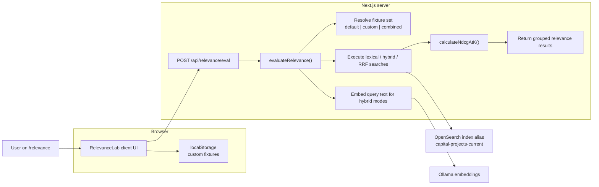

# Relevance Page Guide

This document explains the `/relevance` page in a beginner-friendly way first, then covers the technical implementation for developers.

## What This Page Is For

The relevance page is a small benchmark lab for search quality.

Instead of asking, "did search return something?", it asks:

- did search return the *right* projects?
- which ranking strategy is doing a better job?
- if I tweak the search setup, did ranking improve or get worse?

The page compares three search configurations in this project:

- `Lexical`
- `Hybrid`
- `Hybrid RRF`

It runs the same fixture queries against each configuration and scores the results.

## Beginner View

### What you are looking at

The page has four main parts:

1. A short summary at the top
2. Score cards for each ranking strategy
3. A per-query comparison table
4. A fixture manager for default and custom benchmark queries

### What is a fixture?

A fixture is a small test case for search relevance.

Each fixture contains:

- a label
- a query string
- a list of project ids that are considered relevant
- a relevance rating for each judged project

Example:

- Label: `Queens playground reconstruction`
- Query: `queens playground reconstruction`
- Judged docs: a few known project ids with ratings such as `3`, `2`, or `1`

The goal is to see whether the search engine places those judged documents near the top.

### What does NDCG@10 mean?

The relevance page uses `NDCG@10`.

You can read it as:

- `1.000` means the search results are almost perfectly ranked
- `0.000` means the judged good results are missing or ranked very poorly
- higher is better

The `@10` means the score only looks at the top 10 results.

You do not need to understand the full formula to use the page.
For day-to-day use, the rule is simple:

- compare scores between search strategies
- compare scores before and after a search change
- use the per-query rows to see where the system is weak

### What the score cards mean

Each score card shows the average relevance score for one search configuration across the active fixture set.

If you see:

- `Lexical: 0.607`
- `Hybrid: 0.494`
- `Hybrid RRF: 0.608`

that means:

- lexical and RRF are performing similarly on the current benchmark
- plain hybrid is worse on the current benchmark

This does not mean one strategy is always best.
It only means that it is better on the currently selected fixture set.

### What the comparison table means

The comparison table shows each fixture once and places all search configurations side by side.

This is the fastest way to answer:

- which query is weak?
- which search strategy wins for that query?
- is one configuration consistently worse?

The `Best` column highlights the configuration with the highest score for that specific fixture.

### Default fixtures vs custom fixtures

The page supports two kinds of fixtures.

#### Default fixtures

These ship with the repository.

They are:

- read-only
- meant to be a stable baseline
- useful for repeatable comparisons between code changes

#### Custom fixtures

These are user-editable fixtures stored in your browser.

They are useful when you want to test:

- your own edge cases
- specific park names
- unusual queries
- project ids you care about

Custom fixtures are not saved in OpenSearch.
They are local to the browser unless you export or recreate them elsewhere.

### Fixture set modes

The page can evaluate different scopes:

- `Default fixtures`: use only the repo-managed baseline set
- `Custom fixtures`: use only your browser-local fixtures
- `Combined`: run both together

This lets you keep the default benchmark intact while still testing your own additions.

### When should I use this page?

Use it when:

- you changed search ranking behavior
- you added a new search pipeline
- you want to compare lexical vs hybrid
- you want to check whether a change helped or hurt specific query patterns

Do not use it as a product analytics page.
It is a controlled benchmark, not user behavior reporting.

## How To Use It

### Quick workflow

1. Open `/relevance`
2. Look at the score cards for the high-level winner
3. Look at the per-query table for weak spots
4. Switch the fixture set mode if needed
5. Add or edit custom fixtures if you want to test new cases
6. Click `Run selected fixtures`
7. Compare the results again

### Creating a custom fixture

For a custom fixture to be usable in scoring, it needs:

- a fixture label
- a search query
- at least one judged project id
- a rating for each judged project id

The rating scale is:

- `3`: strongly relevant
- `2`: clearly relevant
- `1`: somewhat relevant
- `0`: judged but not relevant

If a custom fixture is incomplete, it is treated as a draft and excluded from evaluation until completed.

## Common Questions

### Why do the default fixtures exist?

They give the project a stable baseline.

Without a stable baseline, it becomes hard to tell whether a code change improved search or simply changed the benchmark.

### Why are custom fixtures stored in the browser?

This project is local-first and lightweight.

Saving custom fixtures in browser storage means:

- no extra database is needed
- users can experiment safely
- the default benchmark remains clean and reproducible

### Why does the page not use OpenSearch Dashboards?

This page is a purpose-built relevance UI inside the app.

OpenSearch Dashboards is useful for cluster inspection and exploratory analysis, but the relevance page is focused on a fixed benchmark workflow with custom fixture management.

## Technical Overview

The relevance page combines:

- a Next.js page and client UI
- a relevance evaluation API route
- local fixture management in browser storage
- OpenSearch search requests for each ranking configuration
- local NDCG scoring over the returned rankings

### High-level flow

## File Map

These files power the relevance page:

| Path | Responsibility |
| --- | --- |
| `src/app/relevance/page.tsx` | Server entry for the page |
| `src/components/app/relevance-lab.tsx` | Client UI for summary cards, comparison table, and fixture manager |
| `src/app/api/relevance/eval/route.ts` | API endpoint for default, custom, and combined evaluations |
| `src/lib/opensearch/relevance.ts` | Server-side orchestration of relevance evaluation |
| `src/lib/opensearch/relevance-metrics.ts` | Local NDCG scoring helpers |
| `src/lib/opensearch/relevance-fixtures.ts` | Repo-managed default fixtures |
| `src/lib/opensearch/relevance-fixture-utils.ts` | Helper logic for choosing and merging fixture sets |
| `src/lib/types.ts` | Shared request and response contracts for the relevance flow |

## Request Flow In More Detail

### 1. The page loads

The server renders `/relevance` with an initial evaluation using the default fixture set.

### 2. The client loads custom fixtures

The `RelevanceLab` client reads browser-local custom fixtures from `localStorage`.

These custom fixtures are:

- editable
- kept outside OpenSearch
- excluded from scoring until they are complete

### 3. The user selects a fixture mode

The user chooses one of:

- default
- custom
- combined

### 4. The UI sends the active fixture set to the API

The client sends:

- the selected fixture mode
- any valid custom fixtures

### 5. The evaluator runs each ranking configuration

For each active fixture, the server:

- builds the search request
- runs lexical, hybrid, and RRF search
- gathers the returned top results
- compares the ranked ids against the judged ids
- computes `NDCG@10`

### 6. The UI renders the result

The page then shows:

- average score per configuration
- per-query comparison
- the active fixture set details

## Why Scoring Is Done Locally

The page uses local NDCG scoring instead of relying entirely on OpenSearch `_rank_eval`.

That choice keeps the evaluation flow compatible with the search pipeline configurations used by hybrid and RRF in this project.

In practice, the relevance page needs to evaluate the same fixture set across:

- plain lexical search
- hybrid search with a search pipeline
- hybrid search with an RRF pipeline

Local scoring gives the app one consistent evaluation path across all three.

## What "Ready" vs "Draft" Means

In the custom fixture editor:

- `Ready` means the fixture can be scored right now
- `Draft` means it is still missing required information

A draft becomes ready when it has:

- a non-empty label
- a non-empty query
- at least one non-empty judged project id

## Practical Guidance

If you are just learning the page:

- start with `Default fixtures`
- use the comparison table to understand the current ranking behavior
- only add custom fixtures after you know what the default benchmark is telling you

If you are tuning search:

- keep the default fixtures stable
- add custom fixtures for your edge cases
- use `Combined` mode to make sure you do not improve one scenario while breaking the baseline

## Limitations

This page is intentionally lightweight.

It does not currently provide:

- user accounts for sharing custom fixtures
- fixture export and import
- saved benchmark history over time
- large-scale judgment management
- automatic labeling from user click data

Those could be added later if the relevance workflow becomes a bigger part of the project.
